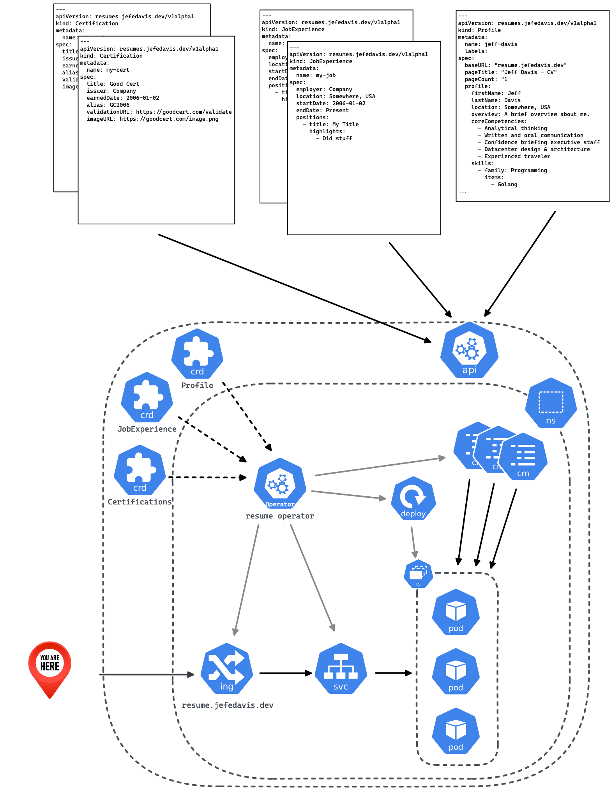

A Kubernetes operator built with
[operator-builder](https://github.com/vmware-tanzu-labs/operator-builder).

# K8s Architecture Diagram

## Local Development & Testing

To install the custom resource/s for this operator, make sure you have a
kubeconfig set up for a test cluster, then run:

    make install

To run the controller locally against a test cluster:

    make run

You can then test the operator by creating the sample manifest/s:

    kubectl apply -f config/samples

To clean up:

    make uninstall

## Deploy the Controller Manager

First, set the image:

    export IMG=myrepo/myproject:v0.1.0

Now you can build and push the image:

    make docker-build
    make docker-push

Then deploy:

    make deploy

To clean up:

    make undeploy

## Companion CLI

To build the companion CLI:

    make build-cli

The CLI binary will get saved to the bin directory.  You can see the help
message with:

    ./bin/resumectl help
